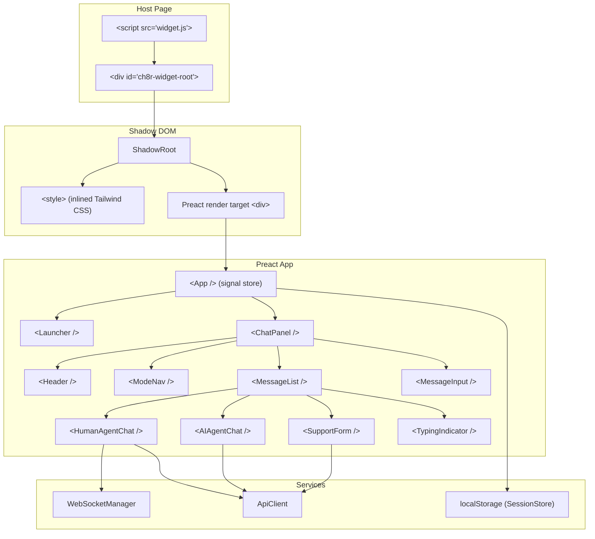
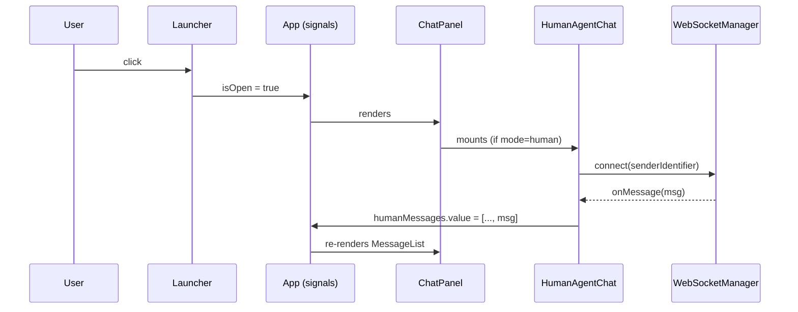

# Design Document: Embeddable Chat Widget

## Overview

The embeddable chat widget (`widget-new`) is a self-contained Preact application delivered as a single IIFE JavaScript bundle. It attaches to the host page via a `<script>` tag, creates a Shadow DOM root for full CSS and DOM isolation, and renders three interaction modes: Human Agent chat (WebSocket), AI Agent chat (REST/streaming), and a Support/Feedback Form.

The widget is built with Vite + Preact + TypeScript, styled with a compiled Tailwind stylesheet injected into the Shadow DOM, and targets a gzipped bundle size under 100 KB.

### Key Design Decisions

- **Preact over React**: ~3 KB runtime vs ~40 KB, critical for the 100 KB budget.
- **Shadow DOM**: Native browser isolation — no CSS leakage in either direction, no dependency on host-page reset styles.
- **Tailwind compiled to static CSS**: The Tailwind CLI produces a single `widget.css` file that Vite inlines into the bundle as a string, then injects as a `<style>` tag inside the Shadow DOM at runtime.
- **Preact Signals** for state management: fine-grained reactivity with minimal overhead (~2 KB), avoiding the boilerplate of `useReducer` + context.
- **IIFE bundle**: avoids polluting the global module scope; the entry point self-executes and exposes only a minimal `window.Ch8rWidget` API.
- **Deferred initialization**: WebSocket connection and localStorage history loading are deferred until the Chat Panel is first opened, keeping the initial render path fast.

---

## Architecture



### Bundle Entry Point

`widget-new/src/main.ts` is the IIFE entry. On execution it:

1. Reads `data-app-uuid` and `data-token` from the `<script>` tag (or `window.Ch8rWidgetConfig`).
2. Validates both values; if missing, logs an error and exits.
3. Creates `<div id="ch8r-widget-root">` and appends it to `document.body`.
4. Attaches a Shadow DOM root (`mode: 'open'`).
5. Injects the compiled Tailwind `<style>` tag into the Shadow DOM.
6. Renders the Preact `<App />` into a `<div>` inside the Shadow DOM.

---

## Components and Interfaces

### Component Tree

```
App
├── Launcher          (fixed FAB, hidden when panel open)
└── ChatPanel         (slide-up panel, visible when open)
    ├── Header        (agent name, status, close button)
    ├── ModeNav       (tab bar: Human | AI | Form)
    ├── MessageList   (scrollable message bubbles + ARIA live region)
    │   └── TypingIndicator
    ├── MessageInput  (textarea + send button)
    └── [active mode view]
        ├── HumanAgentChat   (manages WS connection)
        ├── AIAgentChat      (manages REST/streaming)
        └── SupportForm      (name, email, subject, body)
```

### Component Interfaces (TypeScript)

```typescript
// Launcher
interface LauncherProps {
  isOpen: boolean;
  accentColor: string;
  position: 'bottom-right' | 'bottom-left';
  iconUrl?: string;
  onOpen: () => void;
}

// ChatPanel
interface ChatPanelProps {
  config: WidgetConfig;
  onClose: () => void;
}

// Header
interface HeaderProps {
  agent: AgentInfo;
  title?: string;
  onClose: () => void;
}

// MessageList
interface MessageListProps {
  messages: Message[];
  isTyping: boolean;
}

// MessageInput
interface MessageInputProps {
  onSend: (text: string) => void;
  disabled: boolean;
}

// SupportForm
interface SupportFormProps {
  onSubmit: (data: SupportFormData) => Promise<void>;
}
```

---

## State Management

State is managed with **Preact Signals** (`@preact/signals`). All signals live in `src/store/signals.ts` and are imported directly by components — no prop drilling for global state.

```typescript
// src/store/signals.ts
import { signal, computed } from '@preact/signals';
import type { Message, WidgetConfig, ChatMode, AgentInfo } from '../types';

export const isOpen = signal<boolean>(false);
export const activeMode = signal<ChatMode>('human');
export const config = signal<WidgetConfig | null>(null);

// Per-mode message histories
export const humanMessages = signal<Message[]>([]);
export const aiMessages = signal<Message[]>([]);

// Connection / async state
export const isTyping = signal<boolean>(false);
export const wsStatus = signal<'connecting' | 'connected' | 'disconnected' | 'error'>('disconnected');
export const sendError = signal<string | null>(null);

// Agent info (loaded from config or API)
export const agentInfo = signal<AgentInfo | null>(null);

// Derived
export const activeMessages = computed(() =>
  activeMode.value === 'human' ? humanMessages.value : aiMessages.value
);
```

### State Flow



---

## API Integration Layer

### ApiClient (`src/services/api.ts`)

Thin wrapper around `fetch`. All requests include the `Authorization: Bearer <widgetToken>` header.

```typescript
interface SendMessageRequest {
  message: string;
  sender_identifier: string;
  chatroom_identifier: string | 'new_chat';
  send_to_participant: boolean;
  metadata?: Record<string, unknown>;
}

interface SendMessageResponse {
  uuid: string;
  message: string;
  sender_identifier: string;
  chatroom_identifier: string;
  created_at: string;
  message_status: string;
}

interface SupportFormRequest {
  name: string;
  email: string;
  subject: string;
  body: string;
  sender_identifier: string;
}
```

REST endpoints consumed by the widget:

| Method | Path | Purpose |
|--------|------|---------|
| `POST` | `/api/apps/{appUuid}/messages/` | Send a message (human or AI mode) |
| `GET`  | `/api/apps/{appUuid}/chatrooms/{chatroomUuid}/messages/` | Load history on reconnect |
| `POST` | `/api/apps/{appUuid}/support/` | Submit support/feedback form |

### WebSocketManager (`src/services/websocket.ts`)

Manages the persistent connection to `ws://{host}/ws/updates/{senderIdentifier}/`.

```typescript
class WebSocketManager {
  private ws: WebSocket | null = null;
  private retries = 0;
  private readonly maxRetries = 5;

  connect(senderIdentifier: string, onMessage: (msg: Message) => void): void;
  disconnect(): void;
  private scheduleReconnect(): void; // exponential backoff: 1s, 2s, 4s, 8s, 16s
}
```

Backoff formula: `delay = Math.min(1000 * 2 ** retries, 30_000)` ms, capped at 30 s. After 5 failed retries, `wsStatus` signal is set to `'error'` and the user sees a connection error banner.

---

## Styling Strategy

### Tailwind + Shadow DOM

1. `widget-new/tailwind.config.ts` scans `src/**/*.{ts,tsx}` for class usage.
2. `npm run build:css` runs `tailwindcss -i src/styles/base.css -o src/styles/widget.css --minify`.
3. Vite's `?raw` import loads `widget.css` as a string literal at build time.
4. At runtime, `main.ts` creates a `<style>` element, sets its `textContent` to the CSS string, and appends it to the Shadow DOM root before rendering Preact.

```typescript
// main.ts (simplified)
import widgetCss from './styles/widget.css?raw';

const shadow = hostEl.attachShadow({ mode: 'open' });
const style = document.createElement('style');
style.textContent = widgetCss;
shadow.appendChild(style);
```

### Design Tokens

CSS custom properties are set on the Shadow DOM's `:host` element, allowing theme overrides from config without breaking isolation:

```css
/* base.css */
:host {
  --ch8r-accent: #6366f1;       /* indigo-500 default */
  --ch8r-accent-fg: #ffffff;
  --ch8r-radius: 0.5rem;
  --ch8r-font: system-ui, sans-serif;
}
```

The accent color from `WidgetConfig.accentColor` is applied at runtime:

```typescript
shadow.host.style.setProperty('--ch8r-accent', config.accentColor);
```

### Component Styling Approach

Components use Tailwind utility classes. Where dynamic accent color is needed, inline styles reference the CSS custom property:

```tsx
<button style={{ background: 'var(--ch8r-accent)', color: 'var(--ch8r-accent-fg)' }}>
  Send
</button>
```

---

## Build Configuration

### Vite Config (`widget-new/vite.config.ts`)

```typescript
import { defineConfig } from 'vite';
import preact from '@preact/vite-plugin-preact';

export default defineConfig({
  plugins: [preact()],
  build: {
    lib: {
      entry: 'src/main.ts',
      name: 'Ch8rWidget',
      formats: ['iife'],
      fileName: () => 'widget.js',
    },
    rollupOptions: {
      output: {
        inlineDynamicImports: true,
      },
    },
    minify: 'terser',
    terserOptions: {
      compress: { drop_console: true },
    },
  },
});
```

### Package Structure

```
widget-new/
├── src/
│   ├── main.ts              # IIFE entry point
│   ├── components/
│   │   ├── App.tsx
│   │   ├── Launcher.tsx
│   │   ├── ChatPanel.tsx
│   │   ├── Header.tsx
│   │   ├── ModeNav.tsx
│   │   ├── MessageList.tsx
│   │   ├── MessageInput.tsx
│   │   ├── HumanAgentChat.tsx
│   │   ├── AIAgentChat.tsx
│   │   ├── SupportForm.tsx
│   │   └── TypingIndicator.tsx
│   ├── services/
│   │   ├── api.ts
│   │   ├── websocket.ts
│   │   └── session.ts       # localStorage helpers
│   ├── store/
│   │   └── signals.ts
│   ├── styles/
│   │   ├── base.css         # Tailwind directives + CSS vars
│   │   └── widget.css       # generated, gitignored
│   └── types/
│       └── index.ts
├── vite.config.ts
├── tailwind.config.ts
├── tsconfig.json
└── package.json
```

---

## Data Models

### TypeScript Types (`src/types/index.ts`)

```typescript
export type ChatMode = 'human' | 'ai' | 'form';

export interface WidgetConfig {
  appUuid: string;
  token: string;
  accentColor?: string;       // hex or CSS color, default '#6366f1'
  position?: 'bottom-right' | 'bottom-left';
  title?: string;
  launcherIconUrl?: string;
  aiGreeting?: string;        // shown on first open of AI mode
  apiBaseUrl?: string;        // defaults to same origin
}

export interface Message {
  uuid: string;
  message: string;
  senderIdentifier: string;   // matches ch8r_sender_identifier or agent id
  chatroomIdentifier: string;
  createdAt: string;          // ISO 8601
  isOwn: boolean;             // true if senderIdentifier === local sender UUID
}

export interface AgentInfo {
  name: string;
  role: string;
  isOnline: boolean;
  avatarUrl?: string;
}

export interface SupportFormData {
  name: string;
  email: string;
  subject: string;
  body: string;
}

export interface SupportFormErrors {
  name?: string;
  email?: string;
  subject?: string;
  body?: string;
}
```

### localStorage Schema

All keys are namespaced under `ch8r_` to avoid collisions with host-page storage.

| Key | Type | Description |
|-----|------|-------------|
| `ch8r_sender_identifier` | `string` (UUID v4) | Anonymous visitor identity, created on first load |
| `ch8r_{appUuid}_chatroom_human` | `string` (UUID) | Active human-agent chatroom UUID |
| `ch8r_{appUuid}_messages_human` | `Message[]` (JSON) | Persisted human-agent message history |
| `ch8r_{appUuid}_messages_ai` | `Message[]` (JSON) | Persisted AI-agent message history |

The `SessionStore` service (`src/services/session.ts`) encapsulates all reads/writes:

```typescript
class SessionStore {
  getSenderIdentifier(): string;          // creates + persists UUID if absent
  getChatroomId(appUuid: string): string | null;
  setChatroomId(appUuid: string, id: string): void;
  getMessages(appUuid: string, mode: 'human' | 'ai'): Message[];
  setMessages(appUuid: string, mode: 'human' | 'ai', msgs: Message[]): void;
}
```

---

## Correctness Properties


*A property is a characteristic or behavior that should hold true across all valid executions of a system — essentially, a formal statement about what the system should do. Properties serve as the bridge between human-readable specifications and machine-verifiable correctness guarantees.*

### Property 1: Shadow DOM containment

*For any* widget initialization, the Preact render target and injected `<style>` element SHALL exist inside the `shadowRoot` of the host element, and no new elements SHALL be added to `document.head` or to `document.body` beyond the single host element.

**Validates: Requirements 1.2, 1.3, 1.5**

### Property 2: Launcher visibility is the inverse of panel open state

*For any* widget state, the Launcher SHALL be visible if and only if `isOpen` is `false`, and hidden if and only if `isOpen` is `true`.

**Validates: Requirements 2.2, 2.4**

### Property 3: Clicking the Launcher opens the panel

*For any* widget state where `isOpen` is `false`, simulating a click on the Launcher SHALL set `isOpen` to `true`.

**Validates: Requirements 2.3**

### Property 4: Custom position applied to Launcher

*For any* `WidgetConfig` with a `position` value, the Launcher component SHALL receive that exact position value as its `position` prop.

**Validates: Requirements 2.5**

### Property 5: Accent color applied as CSS custom property

*For any* `WidgetConfig` with an `accentColor` value, the CSS custom property `--ch8r-accent` on the Shadow DOM host element SHALL equal that color value.

**Validates: Requirements 2.6, 8.1, 8.4**

### Property 6: Header renders agent info correctly

*For any* `AgentInfo` value, the rendered Header SHALL contain the agent's `name`, `role`, and an element whose class or attribute reflects the `isOnline` boolean.

**Validates: Requirements 3.1, 4.1, 4.2, 5.1**

### Property 7: Mode switch preserves independent message histories

*For any* sequence of messages sent in `human` mode and `ai` mode, switching `activeMode` between the two SHALL display only the messages belonging to the active mode, with no cross-contamination.

**Validates: Requirements 3.3, 5.5**

### Property 8: Any close action sets isOpen to false

*For any* open panel state, both clicking the close button and pressing the Escape key SHALL set `isOpen` to `false`.

**Validates: Requirements 3.4, 3.5, 9.6**

### Property 9: Offline agent shows unavailability message

*For any* `AgentInfo` with `isOnline = false`, the widget SHALL render an offline indicator and a human-readable unavailability message in the chat area.

**Validates: Requirements 4.3**

### Property 10: Send message request includes correct identifiers

*For any* message text submitted in human or AI mode, the outgoing API request body SHALL include the current `sender_identifier` and the current `chatroom_identifier` (or `'new_chat'` if no chatroom exists yet).

**Validates: Requirements 4.4**

### Property 11: Chatroom ID persisted after creation

*For any* `SendMessageResponse` containing a `chatroom_identifier`, the `SessionStore` SHALL persist that value under `ch8r_{appUuid}_chatroom_human` immediately after the response is received.

**Validates: Requirements 4.5**

### Property 12: WebSocket message appended to humanMessages

*For any* message event received from the WebSocket, that message SHALL be appended to the `humanMessages` signal and the conversation view SHALL scroll to the bottom.

**Validates: Requirements 4.6**

### Property 13: WebSocket URL includes sender_identifier

*For any* `senderIdentifier` string, the WebSocket connection URL constructed by `WebSocketManager.connect()` SHALL contain that identifier as the `client_id` path segment.

**Validates: Requirements 4.8**

### Property 14: Exponential backoff on WebSocket reconnect

*For any* sequence of up to 5 consecutive WebSocket connection failures, the delay before each reconnect attempt SHALL equal `min(1000 * 2^n, 30000)` ms where `n` is the zero-based retry index, and after 5 failures `wsStatus` SHALL be set to `'error'`.

**Validates: Requirements 4.9**

### Property 15: isTyping is true during an in-flight AI request

*For any* AI message submission, `isTyping` SHALL be `true` from the moment the request is sent until the response is received or an error occurs.

**Validates: Requirements 5.2**

### Property 16: AI response round-trip

*For any* AI message submission that succeeds, the response message SHALL be appended to `aiMessages` and `isTyping` SHALL be `false` after the response is processed.

**Validates: Requirements 5.3**

### Property 17: Support form validation rejects invalid inputs

*For any* form submission where at least one required field is empty or the email field does not match a valid email pattern, the submission SHALL be rejected and `SupportFormErrors` SHALL contain a non-empty error string for each invalid field.

**Validates: Requirements 6.2, 6.3**

### Property 18: Successful form submission resets form state

*For any* successful support form submission, the form fields SHALL be reset to empty values and a confirmation message SHALL be rendered.

**Validates: Requirements 6.4**

### Property 19: Sender identifier idempotence

*For any* call to `SessionStore.getSenderIdentifier()`, if a value already exists in localStorage under `ch8r_sender_identifier` it SHALL be returned unchanged; if absent, a new UUID SHALL be generated, persisted, and returned — and subsequent calls SHALL return the same UUID.

**Validates: Requirements 7.1, 7.2**

### Property 20: SessionStore round-trip for messages and chatroom ID

*For any* array of `Message` objects written via `SessionStore.setMessages(appUuid, mode, messages)`, a subsequent call to `SessionStore.getMessages(appUuid, mode)` SHALL return an array deeply equal to the written array. The same round-trip SHALL hold for `setChatroomId` / `getChatroomId`.

**Validates: Requirements 7.3, 7.4, 7.5**

### Property 21: Custom title rendered in header

*For any* `WidgetConfig` with a `title` value, the rendered Header SHALL display that exact string.

**Validates: Requirements 8.2**

### Property 22: Custom launcher icon rendered

*For any* `WidgetConfig` with a `launcherIconUrl` value, the Launcher SHALL render an `` element whose `src` attribute equals that URL.

**Validates: Requirements 8.3**

### Property 23: New messages announced via ARIA live region

*For any* message appended to the active message list, the ARIA live region element (`aria-live="polite"`) inside the Shadow DOM SHALL contain the text content of that message.

**Validates: Requirements 9.3**

### Property 24: Deferred initialization

*For any* widget in the closed state (`isOpen = false`), the `WebSocketManager` SHALL NOT have an active connection and `SessionStore.getMessages()` SHALL NOT have been called.

**Validates: Requirements 10.2**


---

## Error Handling

### API Errors

All `ApiClient` methods return a discriminated union:

```typescript
type ApiResult<T> = { ok: true; data: T } | { ok: false; error: string };
```

On failure, the relevant signal is updated (`sendError`, `formError`) and the UI renders an inline error message. The user's input is preserved so they can retry.

### WebSocket Errors

`WebSocketManager` handles `onerror` and `onclose` events. On unexpected close it schedules a reconnect via exponential backoff. After 5 failed retries it sets `wsStatus = 'error'` and the `HumanAgentChat` component renders a persistent error banner with a manual "Reconnect" button.

### Missing Configuration

If `appUuid` or `token` is absent at initialization, `main.ts` logs `[Ch8rWidget] Missing required configuration: appUuid and token are required.` to the console and returns without rendering anything. No host-page DOM is modified.

### localStorage Unavailability

`SessionStore` wraps all `localStorage` calls in try/catch. If storage is unavailable (e.g. private browsing with storage blocked), the widget falls back to in-memory state for the session and logs a warning. The widget remains fully functional for the current page load.

---

## Testing Strategy

### Dual Testing Approach

Both unit tests and property-based tests are required. They are complementary:

- **Unit tests** cover specific examples, integration points, and error conditions.
- **Property-based tests** verify universal invariants across randomly generated inputs.

### Unit Tests

Framework: **Vitest** + **@testing-library/preact**

Focus areas:
- `main.ts`: Shadow DOM creation, style injection, config parsing from data attributes.
- `SessionStore`: localStorage read/write, UUID generation, fallback to in-memory.
- `ApiClient`: correct headers, correct request body shape, error result on non-2xx.
- `WebSocketManager`: URL construction, reconnect scheduling.
- `SupportForm`: field rendering, label/input association, validation error display.
- `Launcher`: aria-label presence, icon rendering when configured.
- `Header`: agent name/role/status rendering.

### Property-Based Tests

Framework: **fast-check** (TypeScript-native, works with Vitest)

Each property test runs a minimum of **100 iterations**. Each test is tagged with a comment referencing the design property it validates.

Tag format: `// Feature: embeddable-chat-widget, Property {N}: {property_text}`

Property test mapping:

| Design Property | Test Description | fast-check Arbitraries |
|----------------|-----------------|----------------------|
| P1: Shadow DOM containment | `fc.record({ appUuid: fc.uuid(), token: fc.string() })` → assert shadowRoot structure | `fc.record` |
| P2: Launcher visibility inverse | `fc.boolean()` for isOpen → assert Launcher visibility | `fc.boolean()` |
| P3: Click opens panel | Any closed state → click → isOpen=true | `fc.constant(false)` |
| P4: Custom position | `fc.constantFrom('bottom-right', 'bottom-left')` → assert prop | `fc.constantFrom` |
| P5: Accent color CSS var | `fc.hexaString({ minLength: 6, maxLength: 6 })` → assert CSS var | `fc.string` |
| P6: Header agent info | `fc.record({ name: fc.string(), role: fc.string(), isOnline: fc.boolean() })` | `fc.record` |
| P7: Independent histories | `fc.array(messageArb)` for each mode → switch → assert no cross-contamination | `fc.array` |
| P8: Close action | `fc.constantFrom('button', 'escape')` → assert isOpen=false | `fc.constantFrom` |
| P9: Offline message | `fc.record({ isOnline: fc.constant(false), ... })` → assert offline UI | `fc.record` |
| P10: Send request identifiers | `fc.uuid()` × 2 → assert request body fields | `fc.uuid()` |
| P11: Chatroom ID persisted | `fc.uuid()` for chatroom → assert localStorage | `fc.uuid()` |
| P12: WS message appended | `fc.array(messageArb, { minLength: 1 })` → assert signal | `fc.array` |
| P13: WS URL contains sender ID | `fc.string({ minLength: 1 })` → assert URL | `fc.string` |
| P14: Exponential backoff | `fc.integer({ min: 0, max: 5 })` for retry count → assert delay | `fc.integer` |
| P15: isTyping during request | Any message → assert isTyping=true before resolve | `fc.string` |
| P16: AI response round-trip | Any message → mock response → assert in aiMessages, isTyping=false | `fc.string` |
| P17: Form validation | `fc.record` with invalid fields → assert errors set | `fc.record` |
| P18: Form reset on success | Any valid form data → mock success → assert reset | `fc.record` |
| P19: Sender ID idempotence | `fc.option(fc.uuid())` for pre-existing value → assert same UUID returned | `fc.option` |
| P20: SessionStore round-trip | `fc.array(messageArb)` + `fc.uuid()` → write then read | `fc.array`, `fc.uuid` |
| P21: Custom title in header | `fc.string({ minLength: 1 })` → assert rendered | `fc.string` |
| P22: Custom icon rendered | `fc.webUrl()` → assert img src | `fc.webUrl` |
| P23: ARIA live region | `fc.array(messageArb, { minLength: 1 })` → assert live region text | `fc.array` |
| P24: Deferred init | Any closed state → assert no WS connection, no storage read | `fc.boolean` |

### Example Tests (Unit)

- E1: Config parsed from `data-app-uuid` and `data-token` attributes.
- E2: Missing config → no render, console error logged.
- E3: Default Launcher position is `bottom-right`.
- E4: ModeNav renders tabs for Human, AI, and Form.
- E5: AI greeting message present on first AI mode open.
- E6: Support form renders name, email, subject, body fields.
- E7: Each form input has a `<label>` with matching `for`/`id`.
- E8: Launcher has non-empty `aria-label`.
- E9: Tab key cycles focus within open panel (focus trap).
