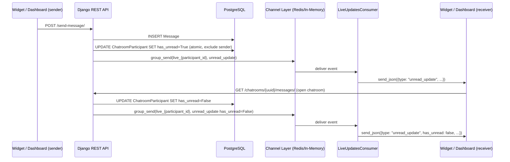

# Design Document: Realtime Unread Messages

## Overview

This feature adds per-participant unread message tracking and real-time delivery to both the dashboard (Nuxt/Vue frontend) and the embeddable widget (Preact, `widget-new`). The core idea is simple: a `has_unread` boolean on `ChatroomParticipant` is the source of truth; it is set when a message arrives and cleared when the participant opens the chatroom. Changes are broadcast over the existing Django Channels WebSocket infrastructure so every connected client updates instantly without polling.

The system has three layers:
1. **Backend** – Django model field, signal/post-save hook, atomic updates, WebSocket broadcast.
2. **Dashboard** – Nuxt/Vue page that reads `has_unread` from the chatroom list API and reacts to `unread_update` WebSocket events.
3. **Widget** – Preact widget that reads `has_unread` from the user-chatrooms API and reacts to both `message` and `unread_update` WebSocket events.

---

## Architecture



The WebSocket group name follows the existing convention: `live_{user_identifier}`. The `LiveUpdatesConsumer` already handles `send_message` and `send_kb_updates` event types; we add `send_unread_update`.

---

## Components and Interfaces

### Backend

**`ChatroomParticipant` model** – gains `has_unread = BooleanField(default=False)`.

**`mark_unread_for_participants(message)` utility** – called after a `Message` is saved. Uses `F`-expression-free atomic `update()` to set `has_unread=True` on all participants except the sender. Returns the list of updated `user_identifier` values so the caller can broadcast.

**`mark_read_for_participant(chatroom, user_identifier)` utility** – called when a participant opens a chatroom. Atomically sets `has_unread=False` and broadcasts the cleared state.

**`broadcast_unread_update(user_identifier, chatroom_uuid, has_unread, sender_identifier)` utility** – wraps `async_to_sync(channel_layer.group_send)` with error handling (log warning, continue).

**`LiveUpdatesConsumer`** – gains a new handler:
```python
async def send_unread_update(self, event):
    await self.send_json({
        "type": "unread_update",
        "chatroom_uuid": event["chatroom_uuid"],
        "has_unread": event["has_unread"],
        "sender_identifier": event["sender_identifier"],
    })
```

**`ChatRoomPreviewSerializer`** – gains `has_unread = serializers.SerializerMethodField()`. The serializer needs the requesting `user_identifier` in context to look up the correct `ChatroomParticipant` record.

**`ApplicationChatRoomsPreviewView`** – passes `user_identifier` (from `request.user`) into serializer context.

**`UserChatRoomsView`** – passes `sender_identifier` (from query param) into serializer context.

**`ChatRoomMessagesView`** – after returning messages, calls `mark_read_for_participant` for the requesting user.

### Dashboard (frontend)

**`useChatroomStore`** – `ChatroomPreview` type gains `has_unread: boolean`. `fetchChatrooms` already populates this from the API. `markUnread` / `markRead` actions remain but are now also driven by `unread_update` WebSocket events.

**`useLiveUpdateStore`** – already dispatches events to subscribers. The chatroom list page subscribes to `unread_update` events.

**Chatroom list page** (to be created at `frontend/pages/applications/[appId]/chatrooms.vue` or integrated into the app layout) – renders an `UnreadBadge` component per row. Subscribes to `unread_update` events. Optimistically clears badge on navigation.

**`UnreadBadge` component** – `frontend/components/UnreadBadge.vue` – a `<span>` with `aria-label="Unread messages"` and a red dot style.

### Widget (widget-new)

**`ChatroomPreview` type** – gains `has_unread: boolean`.

**`signals.ts`** – gains `chatrooms = signal<ChatroomPreview[]>([])` to hold the live chatroom list with unread state. The existing `unreadHuman` / `unreadAI` integer signals are replaced by a derived `computed` that counts `chatrooms.value.filter(c => c.has_unread).length`.

**`WebSocketManager`** – `onmessage` handler extended to also parse `unread_update` events and invoke a registered callback.

**`ChatroomList`** – reads from the `chatrooms` signal instead of local state; renders `UnreadBadge` per row.

**`Launcher`** – reads the derived aggregate unread count signal.

**`UnreadBadge` component** – `widget-new/src/components/UnreadBadge.tsx` – `<span aria-label="Unread messages" class="w-2.5 h-2.5 bg-red-500 rounded-full" />`.

---

## Data Models

### `ChatroomParticipant` (modified)

| Field | Type | Notes |
|---|---|---|
| `has_unread` | `BooleanField` | Default `False`. Set `True` on new message (excluding sender). Set `False` on chatroom open. |

Migration: `0027_chatroomparticipant_has_unread.py`

### WebSocket Event: `unread_update`

```json
{
  "type": "unread_update",
  "chatroom_uuid": "<uuid-string>",
  "has_unread": true,
  "sender_identifier": "<string>"
}
```

### API Response: `ChatRoomPreviewSerializer`

```json
{
  "uuid": "<uuid>",
  "name": "chat:...",
  "last_message": { ... },
  "has_unread": false
}
```

### Channel Layer Group Send Payload

```python
{
    "type": "send.unread_update",   # maps to send_unread_update handler
    "chatroom_uuid": str(chatroom.uuid),
    "has_unread": True,
    "sender_identifier": sender_id,
}
```

---

## Correctness Properties

*A property is a characteristic or behavior that should hold true across all valid executions of a system — essentially, a formal statement about what the system should do. Properties serve as the bridge between human-readable specifications and machine-verifiable correctness guarantees.*

### Property 1: Unread flag set for non-senders

*For any* chatroom with any set of participants, when a new message is saved with a given `sender_identifier`, every participant whose `user_identifier` differs from the sender should have `has_unread = True` after the save, and the sender's record should remain `has_unread = False`.

**Validates: Requirements 1.2**

---

### Property 2: Mark-read clears unread flag

*For any* `ChatroomParticipant` with `has_unread = True`, calling `mark_read_for_participant` for that participant should result in `has_unread = False` on their record.

**Validates: Requirements 1.3**

---

### Property 3: Unread round-trip (set then clear)

*For any* chatroom and participant, setting `has_unread = True` via a new message and then calling `mark_read_for_participant` should return the participant's `has_unread` to `False` — the same state as before the message arrived.

**Validates: Requirements 1.3, 1.4**

---

### Property 4: API response includes has_unread

*For any* chatroom list API response (both `ApplicationChatRoomsPreviewView` and `UserChatRoomsView`), every chatroom object in the response should contain a `has_unread` boolean field.

**Validates: Requirements 2.1, 2.2, 2.3**

---

### Property 5: Missing participant defaults to has_unread=False

*For any* chatroom where no `ChatroomParticipant` record exists for the requesting user, the API should return `has_unread: false` for that chatroom.

**Validates: Requirements 2.4**

---

### Property 6: unread_update event payload completeness

*For any* `unread_update` event delivered to a WebSocket client, the JSON payload should contain exactly the fields `type`, `chatroom_uuid`, `has_unread`, and `sender_identifier`, with correct types.

**Validates: Requirements 3.2, 3.4**

---

### Property 7: WebSocket broadcast on message save

*For any* new message saved to a chatroom, an `unread_update` event with `has_unread: true` should be sent to the WebSocket group of every non-sender participant.

**Validates: Requirements 3.1**

---

### Property 8: WebSocket broadcast on mark-read

*For any* participant who opens a chatroom, an `unread_update` event with `has_unread: false` should be sent to that participant's WebSocket group.

**Validates: Requirements 3.3**

---

## Error Handling

**Channel Layer send failure** – `broadcast_unread_update` wraps each `group_send` call in a `try/except`. On failure it logs `WARNING: Failed to send unread_update to live_{user_identifier}: {error}` and continues. This prevents a single bad participant from blocking the rest (Requirement 3.5).

**Missing `ChatroomParticipant`** – `ChatRoomPreviewSerializer.get_has_unread` returns `False` if no record is found (Requirement 2.4).

**Concurrent message saves** – `ChatroomParticipant.objects.filter(...).update(has_unread=True)` is a single SQL `UPDATE` statement, which is atomic at the database level (Requirement 1.4).

**WebSocket reconnect / missed events** – both the widget and dashboard re-fetch the chatroom list on reconnect to reconcile any state changes that occurred while disconnected (Requirements 7.5, 8.5).

**Widget: message for non-open chatroom** – when a `message` WebSocket event arrives for a chatroom that is not currently open, the widget updates the `has_unread` flag in the `chatrooms` signal directly, without waiting for an `unread_update` event (Requirement 7.2).

---

## Testing Strategy

### Unit Tests (pytest / Django TestCase)

- `ChatroomParticipant` migration applies cleanly and default is `False`.
- `mark_unread_for_participants` sets `has_unread=True` on all non-sender participants.
- `mark_unread_for_participants` does not touch the sender's record.
- `mark_read_for_participant` sets `has_unread=False`.
- `ChatRoomPreviewSerializer` returns `has_unread=True` when the participant record is set.
- `ChatRoomPreviewSerializer` returns `has_unread=False` when no participant record exists.
- `broadcast_unread_update` logs a warning and does not raise when `group_send` throws.
- `LiveUpdatesConsumer.send_unread_update` forwards the correct JSON shape.

### Property-Based Tests (Hypothesis, Python)

Each property test runs a minimum of 100 iterations. Tests are tagged with the format:
`# Feature: realtime-unread-messages, Property N: <property_text>`

**Property 1** – Generate a random chatroom with 1–10 participants and a random sender. Save a message. Assert every non-sender has `has_unread=True` and the sender has `has_unread=False`.

**Property 2** – Generate a participant with `has_unread=True`. Call `mark_read_for_participant`. Assert `has_unread=False`.

**Property 3** – Generate a chatroom + participant. Save a message (sets unread). Call mark-read. Assert `has_unread=False` (round-trip).

**Property 4** – Generate random chatrooms and call the list API. Assert every item in the response has a `has_unread` key of boolean type.

**Property 5** – Generate a chatroom with no participant for the requesting user. Call the list API. Assert `has_unread` is `False` for that chatroom.

**Property 6** – Generate random `unread_update` events and pass them through `send_unread_update`. Assert the emitted JSON contains exactly `type`, `chatroom_uuid`, `has_unread`, `sender_identifier`.

**Property 7** – Generate a chatroom with random participants and a sender. Save a message. Assert `broadcast_unread_update` was called once per non-sender participant with `has_unread=True`.

**Property 8** – Generate a participant opening a chatroom. Assert `broadcast_unread_update` was called with `has_unread=False` for that participant.

### Widget / Frontend Tests (Vitest + @testing-library/preact)

- `UnreadBadge` renders with `aria-label="Unread messages"` when `has_unread` is `true`.
- `ChatroomList` shows badge on rows where `has_unread=true` and hides it where `false`.
- `ChatroomList` clears badge optimistically on row selection.
- `Launcher` shows aggregate badge when any chatroom has `has_unread=true`.
- `Launcher` hides badge when all chatrooms have `has_unread=false`.
- `WebSocketManager` invokes the `unread_update` callback when an `unread_update` event is received.
- Widget re-fetches chatroom list on WebSocket reconnect.

### Dashboard Tests (Vitest + Vue Test Utils)

- `UnreadBadge` component renders with correct `aria-label`.
- Chatroom list row shows badge when `has_unread=true`.
- `useChatroomStore.markRead` removes chatroom from unread list.
- `useChatroomStore.markUnread` adds chatroom to unread list.
- `unread_update` event with `has_unread=true` triggers badge display.
- `unread_update` event with `has_unread=false` removes badge.
